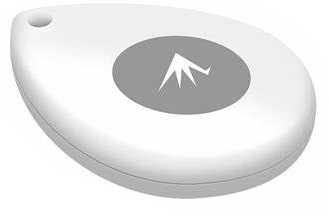
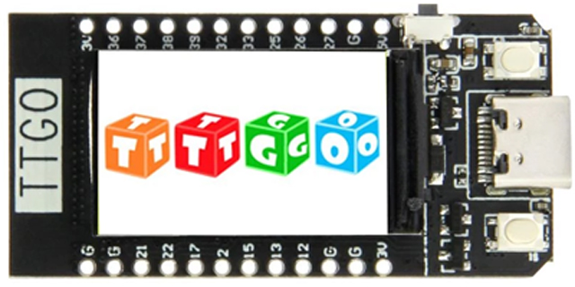

# Swimming-Beacon

A wearable beacon that count the number of length in a swimming-pool.
Un traceur à porter sur soi et qui permet de compter le nombre de longueurs faites dans une piscine ; évidemment avec une base fixe.

## Principes
* Un beacon bluetooth étanche porté par le nageur ;
* Une base fixe, posée à l'extrémité du bassin avec un afficheur qui indique le nombre de longueurs réalisées ;
* Peut-être traçabilité d'autres grandeurs physiques (vitesse instantanée, moyenne, par longueur, etc.)

## Composants du prototype
* Un beacon bluetooth Feasycom FSC-BP108 IP67 Waterproof (https://www.feasycom.com/product/bluetooth-5-1-beacon-tags-location) ;
  
* Une carte CPU pour assurer traitements et stockage des données avec connectivité au-moins Bluetooth : Lilygo TTGO T-Display (http://www.lilygo.cn/prod_view.aspx?TypeId=50033&Id=1126&FId=t3:50033:3) ;
  
* Un "emballage" de l'afficheur pour s'assurer de sa visibilité et de sa protection en bout de bassin (Impression 3D).

## Références sur le Bluetooth
Utilisation du Bluetooth version 5.1 avec gestion d'un beacon en mouvement (mesure de distance en temps réel).

Remontée d'une mesure de température du beacon si la fonction est disponible (intérêt ?).

## Code ESP32
Développement en IDE Arduino 2.0++ (béta) avec librairies :
* https://github.com/Bodmer/TFT_eSPI ;
* https://github.com/arduino-libraries/ArduinoBLE ;

https://github.com/Marcussacapuces91/Swimming-Beacon/blob/main/TTGO_beacon/

